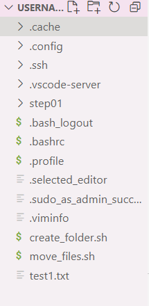
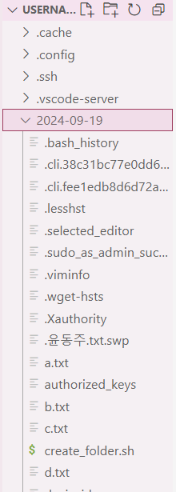

# Crontab_Test 💪
Crontab을 활용한 TIL(Today I Learned) 정리

# 개요📢
하루동안의 Woori Fisa 수업과정을 통해 나온 결과물들을 하나의 폴더에 하루마다 저장하여 정리해주는 자동화 시스템을 만들어보고자 하여 기획하게 되었습니다.

# 폴더 생성 sh 생성 🔨
```bash
#!/bin/bash

# 폴더가 생성될 경로
DIR="/home/username"

# 오늘 날짜를 'YYYY-MM-DD' 형식으로 가져옴
TODAY=$(date +"%Y-%m-%d")

# 폴더가 이미 존재하는지 확인하고, 없으면 생성
if [ ! -d "$DIR/$TODAY" ]; then
    mkdir "$DIR/$TODAY"
fi
```
# 파일 이동 sh 생성 🔨
```bash
# move_file.sh 생성
#!/bin/bash

# 파일들이 위치한 디렉토리 (파일을 찾을 경로)
SOURCE_DIR="/home/username"

# 폴더가 생성될 경로 (오늘 날짜 폴더가 위치한 경로)
DEST_DIR="/home/username"

# 오늘 날짜를 'YYYY-MM-DD' 형식으로 가져옴
TODAY=$(date +"%Y-%m-%d")

# 오늘 날짜 폴더가 없으면 생성
if [ ! -d "$DEST_DIR/$TODAY" ]; then
    mkdir "$DEST_DIR/$TODAY"
fi

# 오늘 작성된 파일들을 찾고 폴더로 이동
find "$SOURCE_DIR" -type f -newermt $(date +%Y-%m-%d) ! -newermt $(date +%Y-%m-%d -d tomorrow) -exec mv {} "$DEST_DIR/$TODAY" \;
```

# Cron tab 설정 💻
```bash
// 오전 7시에 create_folder.sh 실행
0 7 * * *  /home/username/create_folder.sh >/dev/null 2>&1
// 오후 11시 59분에 move_files.sh 실행
59 23 * * * /home/username/move_files.sh >/dev/null 2>&1 
```

# 결과 
## Crontab 적용 전

</br>
## Crontab 적용 후

</br>
